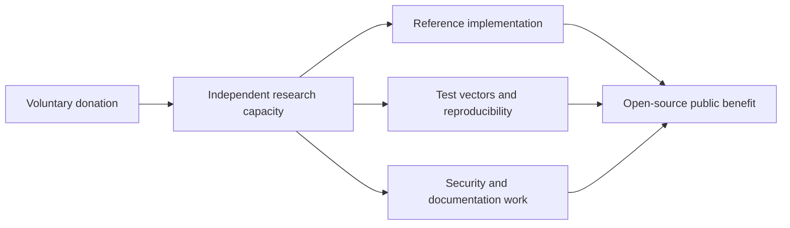
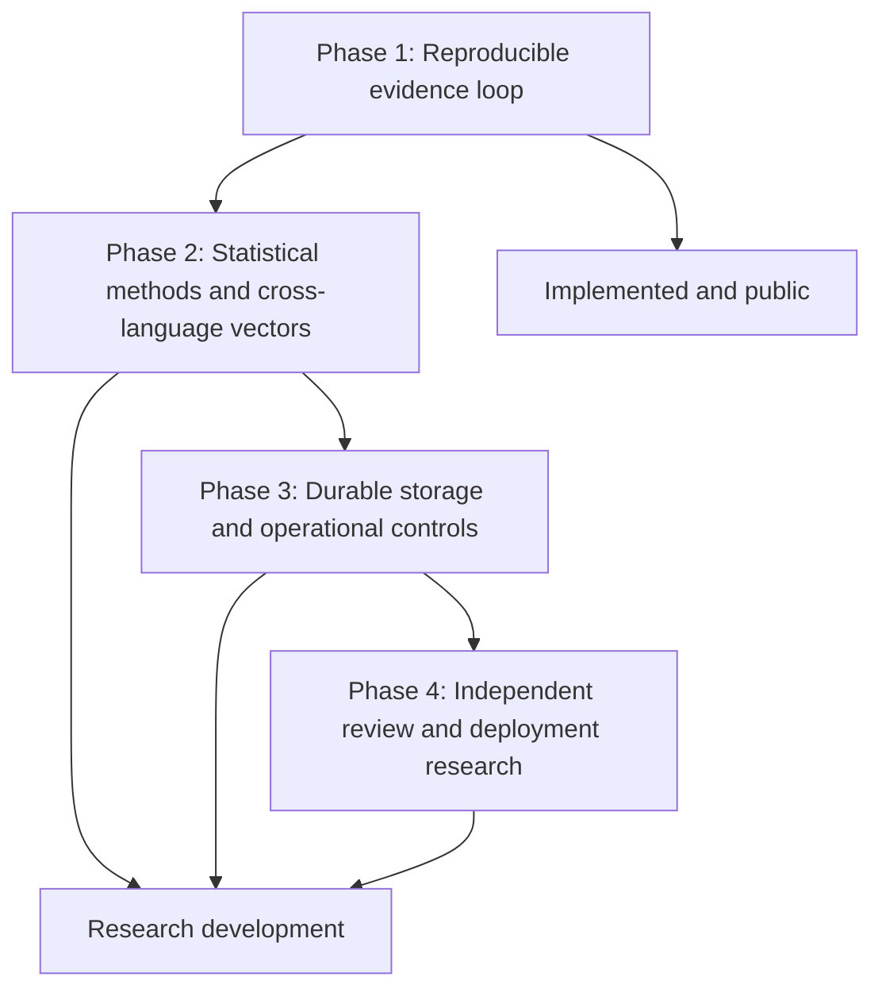

# Support CIGP Research

**CIGP: Casino Integrity & Gaming Proof Protocol** is an independent, open-source research program led by **Ciprian Ștefan Pleșca**, an independent Romanian researcher based in Roman, Neamt County, Romania.

The project investigates reproducible cryptographic evidence for declared gaming-system events. Its purpose is not to operate gambling, process real-money transactions, certify operators, or make legal conclusions. Its purpose is to make selected technical claims inspectable: evidence can be reproduced, checked, and rejected when inconsistent.

## Why Support This Work?

Complex technical systems are often described through claims that external observers cannot independently test. CIGP explores a different model: deterministic evidence, open specifications, reference implementations, and reproducible verification.

Financial support helps sustain work that is difficult to compress into a short prototype:

- rigorous protocol documentation and academic research writing;
- reproducible test vectors and cross-language verification work;
- security-focused review, threat modelling, and dependency hygiene;
- statistical research utilities that remain clearly separate from cryptographic proof;
- open-source maintenance, issue review, and contributor guidance;
- future independent review and responsible disclosure preparation.

The project makes no claim of being the only work in this area. Its value lies in its open, bounded, and reproducible approach: cryptographic verification, statistical analysis, software integrity, and regulatory certification are documented as distinct questions rather than merged into one marketing claim.

## What a Donation Supports

Donations support the independent research effort behind these phases. They do not purchase ownership, preferential verification results, regulatory approval, product access, gambling services, or a guaranteed delivery date. Project priorities remain governed by technical evidence, security considerations, available resources, and the public roadmap.

## Transparency and Donor Expectations

This is a voluntary contribution to an independent open-source research project. Please donate only if you are comfortable doing so and only through the official link below. A donation is not an investment, is not a security, and does not create a contractual relationship, partnership, or tax-deductible charitable receipt unless separately confirmed by an appropriate legal entity.

The project will continue to state its limits plainly. Donations do not convert research results into a statement that any gaming system is fair, honest, certified, legal, secure, or suitable for real-money operation.

## Donate via PayPal

  <a href="https://www.paypal.com/paypalme/agentflowenterprise"><strong>Donate to support CIGP research via PayPal</strong></a>

Official donation link: [https://www.paypal.com/paypalme/agentflowenterprise](https://www.paypal.com/paypalme/agentflowenterprise)

## Contact

**Ciprian Ștefan Pleșca**

Independent Romanian Researcher

Roman, Neamt County, Romania
Email: [contact@agentflow-enterprise.com](mailto:contact@agentflow-enterprise.com)

---

# ادعم أبحاث CIGP

**CIGP: بروتوكول نزاهة الكازينو وإثباتات الألعاب** هو برنامج بحثي مستقل ومفتوح المصدر يقوده **تشيبريان شتيفان بليشكا**، باحث روماني مستقل مقيم في مدينة رومان، مقاطعة نيامت، رومانيا.

يبحث المشروع في أدلة تشفيرية قابلة لإعادة الإنتاج للأحداث المعلنة في أنظمة الألعاب. وليس هدفه تشغيل المقامرة أو معالجة معاملات بأموال حقيقية أو اعتماد المشغلين أو إصدار استنتاجات قانونية. بل يتمثل هدفه في جعل ادعاءات تقنية محددة قابلة للفحص: إذ يمكن إعادة إنتاج الأدلة والتحقق منها ورفضها عندما تكون غير متسقة.

## لماذا تدعم هذا العمل؟

غالباً ما توصف الأنظمة التقنية المعقدة من خلال ادعاءات لا يستطيع المراقبون الخارجيون اختبارها بصورة مستقلة. ويستكشف CIGP نموذجاً مختلفاً: أدلة حتمية، ومواصفات مفتوحة، وتنفيذات مرجعية، وتحقيقاً قابلاً لإعادة الإنتاج.

يساعد الدعم المالي في استدامة عمل يصعب اختزاله في نموذج أولي قصير:

- توثيق صارم للبروتوكول وكتابة بحثية أكاديمية؛
- متجهات اختبار قابلة لإعادة الإنتاج وعمل للتحقق عبر لغات برمجة متعددة؛
- مراجعة تركز على الأمان، ونمذجة للتهديدات، ونظافة للاعتماديات؛
- أدوات بحث إحصائي تبقى مفصولة بوضوح عن الإثبات التشفيري؛
- صيانة مفتوحة المصدر، ومراجعة للمشكلات، وإرشاد للمساهمين؛
- تحضير لمراجعة مستقلة مستقبلية ولإفصاح مسؤول عن الثغرات.

لا يدعي المشروع أنه العمل الوحيد في هذا المجال. وتكمن قيمته في نهجه المفتوح والمحدود والقابل لإعادة الإنتاج: إذ تُوثق عملية التحقق التشفيري والتحليل الإحصائي وسلامة البرمجيات والاعتماد التنظيمي كأسئلة منفصلة، بدلاً من دمجها في ادعاء تسويقي واحد.

## ما الذي تدعمه التبرعات؟

تدعم التبرعات الجهد البحثي المستقل الكامن وراء هذه المراحل: الحلقة القابلة لإعادة الإنتاج للأدلة في المرحلة الأولى، والأساليب الإحصائية ومتجهات التحقق عبر اللغات في المرحلة الثانية، والتخزين الدائم والضوابط التشغيلية في المرحلة الثالثة، والمراجعة المستقلة وأبحاث النشر في المرحلة الرابعة.

لا تشتري التبرعات ملكية أو نتائج تحقق تفضيلية أو موافقة تنظيمية أو وصولاً إلى منتج أو خدمات مقامرة أو موعد تسليم مضمون. وتظل أولويات المشروع محكومة بالأدلة التقنية واعتبارات الأمان والموارد المتاحة وخارطة الطريق العامة.

## الشفافية وتوقعات المتبرعين

هذه مساهمة طوعية في مشروع بحثي مستقل ومفتوح المصدر. يرجى التبرع فقط إذا كنت مرتاحاً للقيام بذلك، وفقط عبر الرابط الرسمي أدناه. التبرع ليس استثماراً، وليس ورقة مالية، ولا ينشئ علاقة تعاقدية أو شراكة أو إيصالاً خيرياً معفى من الضرائب ما لم يؤكد ذلك كيان قانوني مناسب بشكل منفصل.

سيواصل المشروع توضيح حدوده بشكل صريح. ولا تحوّل التبرعات نتائج البحث إلى تصريح بأن أي نظام ألعاب عادل أو نزيه أو معتمد أو قانوني أو آمن أو مناسب للتشغيل بأموال حقيقية.

## التبرع عبر PayPal

[تبرع لدعم أبحاث CIGP عبر PayPal](https://www.paypal.com/paypalme/agentflowenterprise)

الرابط الرسمي للتبرع: [https://www.paypal.com/paypalme/agentflowenterprise](https://www.paypal.com/paypalme/agentflowenterprise)

## التواصل

**تشيبريان شتيفان بليشكا**

باحث روماني مستقل

رومان، مقاطعة نيامت، رومانيا
البريد الإلكتروني: [contact@agentflow-enterprise.com](mailto:contact@agentflow-enterprise.com)

