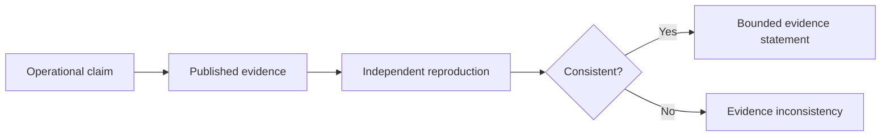
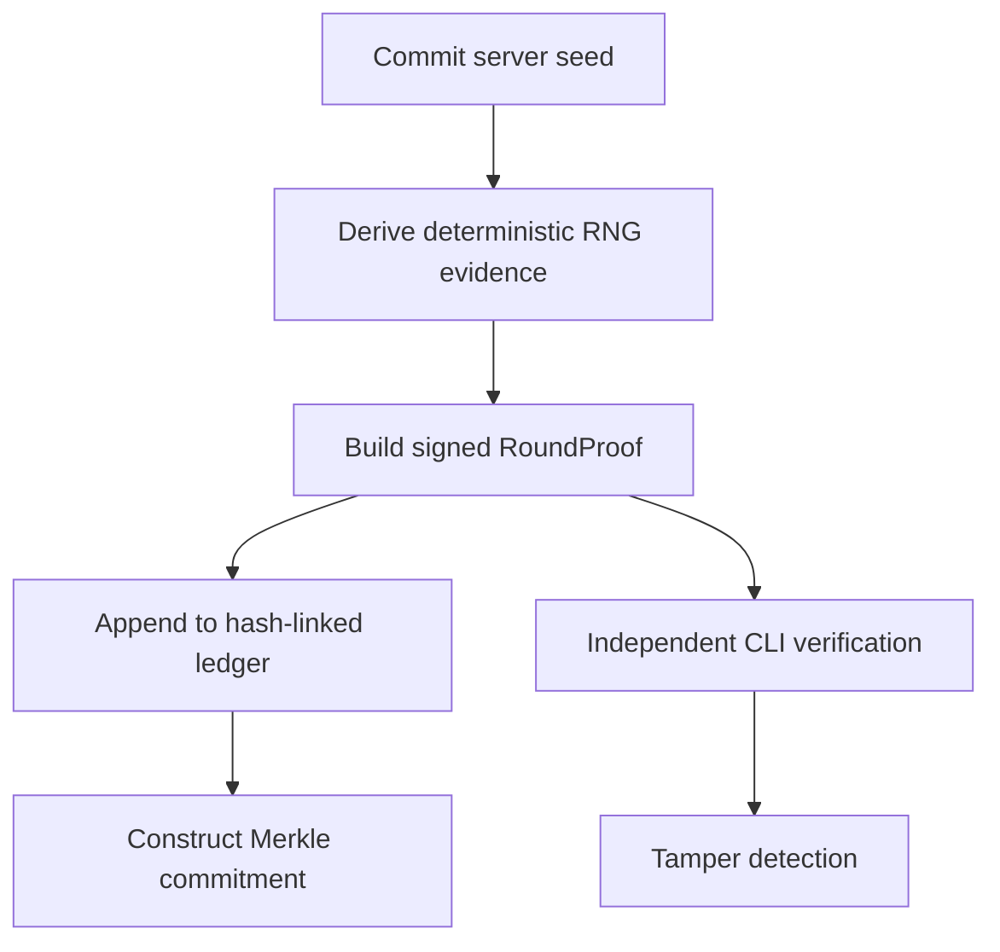

# CIGP Research Manifesto

**Author:** Ciprian Ștefan Pleșca

**Release context:** Phase 1 / Stage 1, 2026

**Project:** Casino Integrity & Gaming Proof Protocol

## Premise

Digital gaming systems are frequently assessed through institutional trust, periodic inspection, or opaque implementation claims. CIGP investigates a more constrained question: which event-level statements can be independently reproduced from disclosed cryptographic evidence?

The objective is not to declare a casino honest or a game fair. The objective is to make selected claims falsifiable: a seed commitment, deterministic derivation, declared outcome, declared configuration fingerprint, signature, and ledger position can either be reproduced or rejected.

## Principles

1. **Verifiability before persuasion.** CIGP values reproducible evidence above untestable assurances.
2. **Narrow claims before broad narratives.** A cryptographic check is not a fairness finding, a certification, or a legal conclusion.
3. **Open specifications before vendor dependence.** Reference behavior, schemas, and test vectors should be inspectable.
4. **Determinism before convenience.** The same inputs must reproduce the same evidence across independent implementations.
5. **Research integrity before product theatre.** Unimplemented components are explicitly marked as reference, research, experimental, or design-only.
6. **Privacy by minimization.** Evidence should not require player identity, payment details, passwords, or operational secrets unrelated to verification.

## Phase 1 Thesis

Phase 1 establishes the smallest credible end-to-end evidence loop.

This release is deliberately modest. It proves that the reference path can be built, tested, inspected, and made to fail when evidence is altered. It does not assert that every operational condition required for a production gaming environment has been solved.

## Non-Claims

CIGP does not operate gambling services or process real-money transactions. It does not optimize wagers, predict outcomes, accuse entities of fraud, replace accredited laboratories, grant regulatory approval, or make legal determinations.

## Invitation

The project invites technical criticism, reproducibility studies, test-vector review, cryptographic review, and contributions that make its claims more precise. The appropriate response to a research protocol is not belief; it is inspection.
