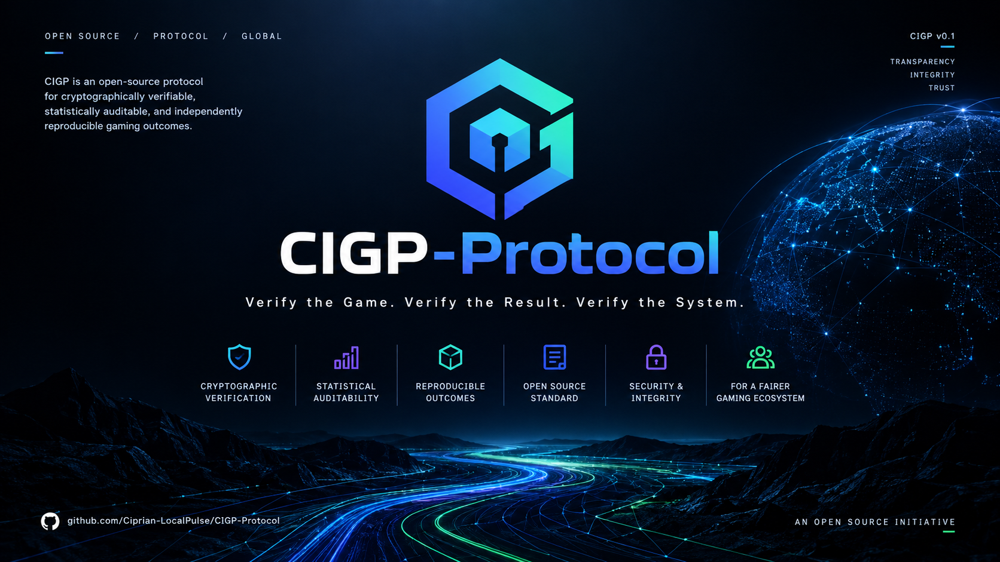
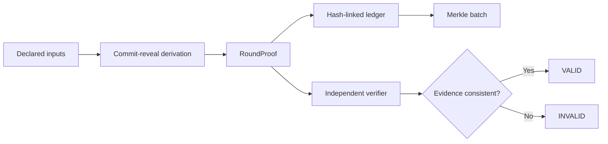
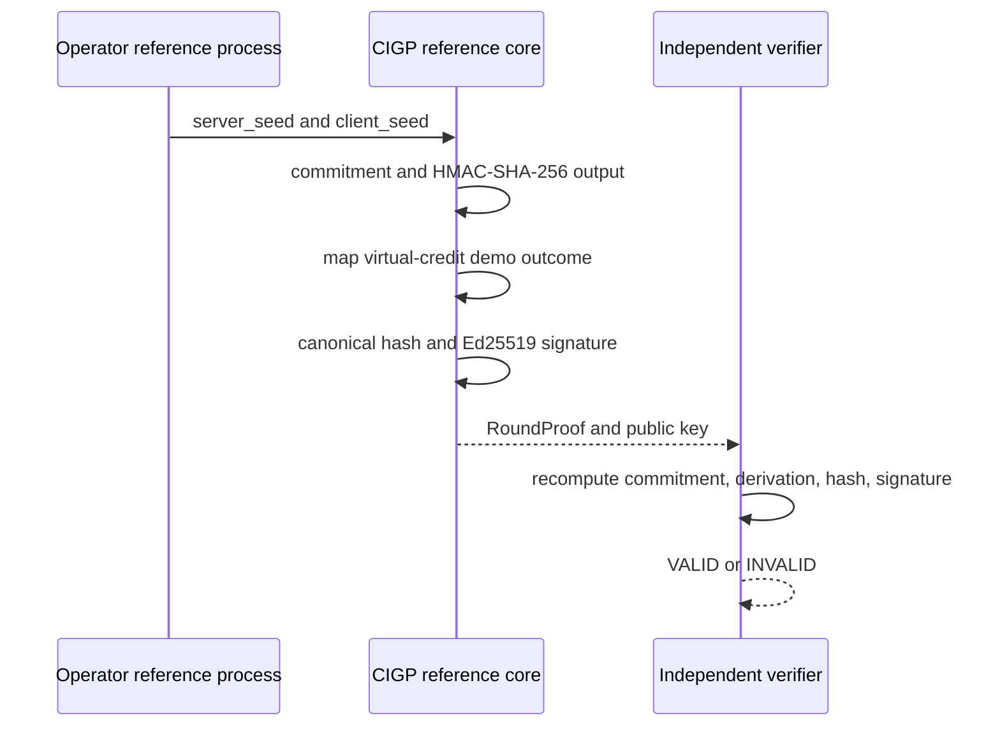
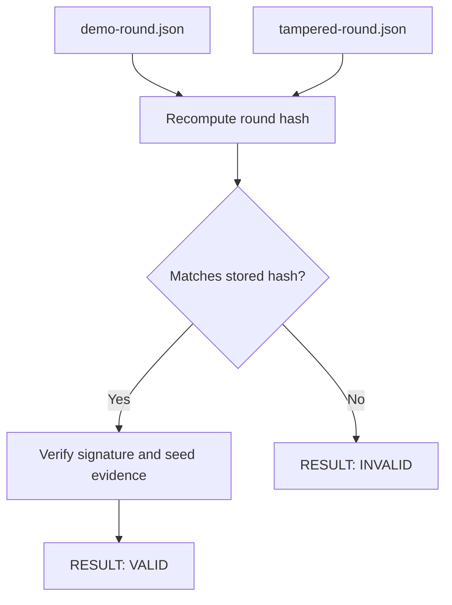
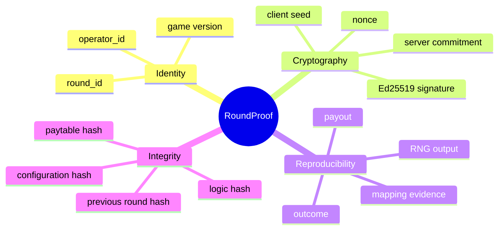
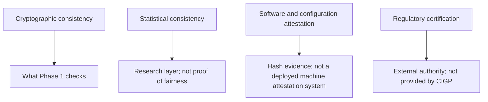
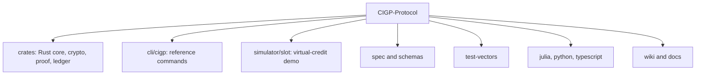

<p align="center">
  
</p>

# CIGP: Casino Integrity & Gaming Proof Protocol

**Phase 1 / Stage 1 Research Release**

Author: **Ciprian Ștefan Pleșca**

License: Apache-2.0

Status: Research infrastructure and reference implementation
Protocol version: `0.1`

> CIGP is an open, vendor-neutral evidence protocol for independently reproducing and verifying declared gaming-system events. It is not a casino, a payment system, a regulator, or a certification authority.

## Abstract

Gaming systems combine random inputs, mapping rules, game logic, paytables, and configuration. CIGP studies how these inputs can be bound into a signed, reproducible evidence object: a `RoundProof`. The Phase 1 reference implementation demonstrates deterministic proof generation, independent cryptographic verification, a hash-linked audit ledger, Merkle inclusion proofs, and deliberate tamper detection using a virtual-credit slot example.

The project makes narrow, testable claims. A valid CIGP proof establishes consistency between supplied evidence and the declared reference construction. It does not establish that an operator is honest, that a game is licensed, or that observed outcomes are statistically fair.



## Phase 1 Result

Phase 1 is an end-to-end research milestone, not a finished certification platform.

| Capability | Phase 1 status |
| --- | --- |
| Typed `RoundProof` and exact money representation | Implemented |
| Canonical JSON hashing and commit-reveal derivation | Implemented |
| Ed25519 signatures | Implemented |
| Hash-linked audit ledger and Merkle inclusion proof | Implemented |
| `cigp` CLI generation and verification | Implemented |
| Virtual-credit demo slot | Implemented |
| Tamper fixture and negative verification result | Implemented |
| Batch ledger, reload, and full chain verification | Implemented research reference |
| Descriptive RTP and payout-variance report | Implemented research reference |
| Cross-language canonicalization and HMAC vectors | Implemented for Rust, Python, and TypeScript |
| Julia statistical utilities | Implemented research reference |
| Python anomaly utilities | Implemented research reference |
| TypeScript verifier helpers | Implemented research reference |
| Regulatory certification or real-money operation | Out of scope |



## Reproduce the Demonstration

Prerequisite: stable Rust.

```bash
cargo test --workspace
cargo run -p cigp -- generate-demo-round test-vectors
cargo run -p cigp -- verify test-vectors/demo-round.json
cargo run -p cigp -- verify test-vectors/tampered-round.json
```

The valid fixture returns `RESULT: VALID`. The tampered fixture deliberately changes the payout and returns `RESULT: INVALID` with exit code `1`.

### Batch ledger and descriptive statistics

```bash
cargo run -p cigp -- generate-demo-ledger 100 output
cargo run -p cigp -- ledger-verify output/demo-ledger.jsonl <public-key-hex>
cargo run -p cigp -- stats output/demo-ledger.jsonl
```

The batch command produces an append-only JSONL ledger, a public key sidecar, a Merkle root, and a deterministic descriptive-statistics report. See [JSONL ledger operations](docs/operations/jsonl-ledger.md) and [Phase 2/3 release note](docs/releases/phase-2-3.md). These metrics are descriptive only; they do not establish fairness or certification.



## Evidence Model

`RoundProof` binds the following evidence categories.



The current cryptographic profile is documented in [spec/cryptographic-profile.md](spec/cryptographic-profile.md). The reference schema lives in [schemas/round-proof.schema.json](schemas/round-proof.schema.json).

## Research Boundaries

CIGP must not be read as a claim of institutional, statistical, or legal certainty.



- No real-money gambling, payment processing, wagering, prediction, or player-loss optimization is implemented.
- No CIGP artifact replaces licensing, accredited laboratory testing, regulatory approval, legal advice, or a security audit.
- An anomaly is a reason to investigate, never an automatic accusation of fraud.
- Physical machine attestation is design-only in v0.1.

## Academic Documentation and Wiki

The repository keeps its Phase 1 research narrative under version control.

| Document | Purpose |
| --- | --- |
| [MANIFESTO.md](MANIFESTO.md) | Research position and epistemic commitments |
| [GitHub Wiki](https://github.com/Ciprian-LocalPulse/CIGP-Protocol/wiki) | Wiki entry point |
| [Research Question](https://github.com/Ciprian-LocalPulse/CIGP-Protocol/wiki/01-Research-Question) | Problem statement and research question |
| [Architecture](https://github.com/Ciprian-LocalPulse/CIGP-Protocol/wiki/02-Architecture) | Architecture and evidence lifecycle |
| [Verification Method](https://github.com/Ciprian-LocalPulse/CIGP-Protocol/wiki/03-Verification-Method) | Reproducibility and verification method |
| [Phase 1 Results](https://github.com/Ciprian-LocalPulse/CIGP-Protocol/wiki/04-Phase-1-Results) | Implemented milestone and test evidence |
| [Limitations and Roadmap](https://github.com/Ciprian-LocalPulse/CIGP-Protocol/wiki/05-Limitations-and-Roadmap) | Limitations and phased research roadmap |
| [Academic Evidence Package](docs/academic/README.md) | Claim-to-evidence mapping, reproduction procedure, and position paper |
| [Verification Receipt Standard](docs/standards/verification-receipt.md) | Portable, bounded independent-verification result |
| [DONATE.md](DONATE.md) | Support the independent research program |

## Repository Map



## Governance, Security, and Contribution

Read [SECURITY.md](SECURITY.md), [GOVERNANCE.md](GOVERNANCE.md), and [CONTRIBUTING.md](CONTRIBUTING.md) before contributing. Security claims must remain bounded by the code, test vectors, and published threat model.

## Citation

```text
Pleșca, Ciprian Ștefan. CIGP: Casino Integrity & Gaming Proof Protocol.
Phase 1 / Stage 1 Research Release, 2026. Apache-2.0.
```

## License

Copyright 2026 Ciprian Ștefan Pleșca. Licensed under the [Apache License 2.0](LICENSE).
