<p align="center">
  
</p>

<h1 align="center">CIGP — Casino Integrity &amp; Gaming Proof Protocol</h1>

<p align="center">
  <em>Verify the Game. Verify the Result. Verify the System.</em>
</p>

<p align="center">
  <a href="#license"></a>
  <a href="#status"></a>
  <a href="#version"></a>
</p>

---

**Author:** Ciprian Ștefan Pleșca
**License:** Apache License 2.0
**Status:** Draft specification (v0.1) — open for public review and contribution
**Repository type:** Open-source protocol / research infrastructure (not a gambling operator, not a casino platform)

---

## Abstract

Regulated and unregulated gaming systems — both physical slot machines and online casino platforms — rely on Random Number Generators (RNGs), deterministic game-logic engines, and paytables to compute the outcome of a bet. In current practice, the correctness of this chain of computation is asserted by the operator and, at best, periodically inspected by an independent test laboratory. Between inspections, a player, auditor, or regulator has no practical mechanism to verify — on a per-round basis — that the outcome delivered actually matches the declared RNG output, the declared game logic, and the declared paytable.

**CIGP (Casino Integrity & Gaming Proof Protocol)** addresses this gap. It is not a random number generator, a casino platform, or a blockchain product. It is an **evidence layer**: an open specification, reference implementation, and verifier tooling that allow any party — player, operator, independent laboratory, or regulator — to cryptographically and statistically verify that a given gaming round was computed exactly as declared, without needing to trust the operator's word.

CIGP does not attempt to prove that "a casino is honest." It defines a narrower, more defensible claim:

> *CIGP provides cryptographically verifiable, statistically auditable, and continuously monitored evidence of gaming-system integrity.*

## Table of Contents

1. [Motivation](#1-motivation)
2. [Design Principles](#2-design-principles)
3. [System Overview](#3-system-overview)
4. [Protocol Architecture](#4-protocol-architecture)
5. [The RoundProof Object](#5-the-roundproof-object)
6. [Seed Commitment Model](#6-seed-commitment-model)
7. [Game Logic Fingerprinting](#7-game-logic-fingerprinting)
8. [Immutable Audit Ledger](#8-immutable-audit-ledger)
9. [Statistical Integrity Engine](#9-statistical-integrity-engine)
10. [Physical Casino Bridge](#10-physical-casino-bridge)
11. [Trust Levels](#11-trust-levels)
12. [What CIGP Does NOT Claim](#12-what-cigp-does-not-claim)
13. [Repository Structure](#13-repository-structure)
14. [Technology Stack](#14-technology-stack)
15. [Roadmap](#15-roadmap)
16. [Relation to Existing Standards](#16-relation-to-existing-standards)
17. [Contributing](#17-contributing)
18. [License](#18-license)

---

## 1. Motivation

Modern electronic gaming machines and online casino platforms generate outcomes through a pipeline that is invisible to the player:

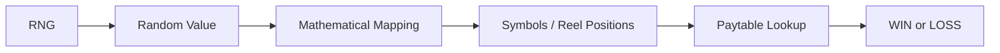

A player who loses ten rounds in succession has no way to know whether that outcome is consistent with the declared Return to Player (RTP), or whether the underlying RNG, mapping function, or paytable was altered. Regulatory bodies such as the UK Gambling Commission require outcomes to be demonstrably "acceptably random" and prohibit adaptive game behaviour, while technical standards such as GLI-19 mandate statistical testing of RNGs and of the mapping between RNG output and game outcome. These frameworks establish *what* must be true; they do not, by themselves, give any external party a practical tool to verify a *specific round*, in real time, without institutional access.

CIGP is designed to close that practical gap by making per-round, per-game, and per-machine integrity independently verifiable.

## 2. Design Principles

| Principle | Description |
|---|---|
| **Verify, don't trust** | Every claim CIGP makes must be independently reproducible by a third party from published proofs. |
| **Narrow, defensible claims** | CIGP proves specific cryptographic and statistical facts — it never claims to prove abstract "fairness" or "honesty." |
| **Standard cryptography only** | CIGP does not invent new cryptographic primitives; it composes SHA-256, HMAC-SHA-256, HKDF, Ed25519, and Merkle trees. |
| **Protocol, not product** | CIGP is designed as an open standard (comparable in spirit to how TLS underpins HTTPS) rather than a proprietary platform. |
| **Evidence infrastructure, not a regulator** | CIGP produces evidence for laboratories and regulators; it does not replace certification bodies or licensing authorities. |
| **Physical and digital parity** | The same evidentiary model applies to online RNGs and to physical slot machines via a firmware/machine attestation bridge. |

## 3. System Overview

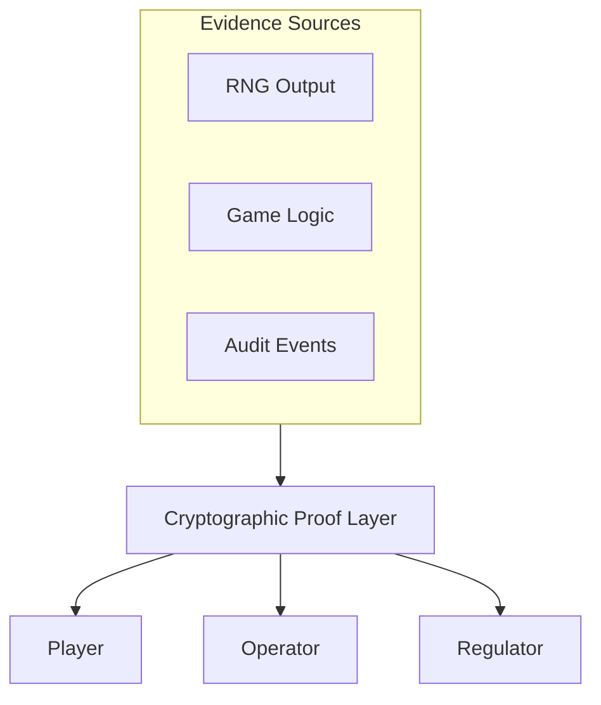

Every gaming round produces a **RoundProof**: a signed, hash-linked object that binds together the bet, the server seed commitment, the client seed, the RNG output, the game-logic version, the paytable version, the resulting outcome, and the payout. Any party holding a RoundProof and the corresponding public game manifest can independently recompute the outcome and confirm it matches.

## 4. Protocol Architecture

CIGP is organised into nine cooperating subsystems:

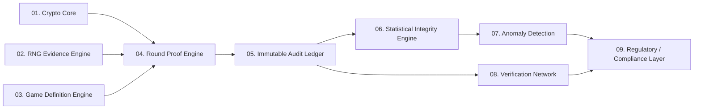

**Round lifecycle**, end to end:

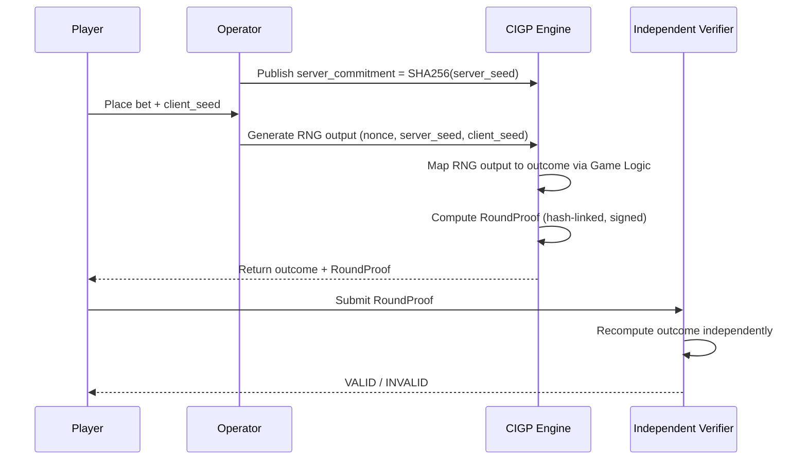

## 5. The RoundProof Object

Each round is represented as a canonical, signed JSON object. Illustrative shape (see [`schemas/round-proof.schema.json`](schemas/round-proof.schema.json) for the normative schema):

```json
{
  "cigp_version": "0.1",
  "round_id": "01JEXAMPLE928374",
  "operator_id": "operator-example",
  "game_id": "slot-example-001",
  "game_version": "3.2.1",
  "currency": "EUR",
  "bet": "10.00",
  "server_commitment": "sha256:...",
  "client_seed": "player-seed-74291",
  "nonce": 1847,
  "rng": { "algorithm": "CSPRNG", "version": "1.0", "output": "..." },
  "mapping": { "algorithm": "...", "version": "...", "parameters_hash": "..." },
  "outcome": { "symbols": ["BAR", "CHERRY", "SEVEN"] },
  "paytable_hash": "sha256:...",
  "game_logic_hash": "sha256:...",
  "payout": "0.00",
  "previous_round_hash": "sha256:...",
  "round_hash": "sha256:...",
  "signature": "ed25519:...",
  "timestamp": "2026-09-09T11:00:00Z"
}
```

Each round hash includes the previous round's hash, forming a hash chain analogous to a append-only ledger — tampering with any past round invalidates every subsequent hash.

## 6. Seed Commitment Model

CIGP uses a standard **commit → play → reveal** scheme:

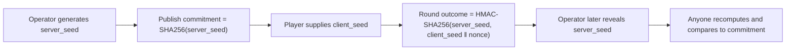

This binds the operator to a seed *before* the round is played, while allowing the player to influence the input, and allowing anyone to verify — after the reveal — that the seed used matches the original commitment.

> **Note:** this is the CIGP proof mechanism. The underlying RNG of a regulated system may be required to meet additional certification standards, which CIGP treats as a separate, complementary concern.

## 7. Game Logic Fingerprinting

Verifying the RNG alone is insufficient: an operator could leave the RNG untouched while altering the function that *maps* RNG output to symbols, or the paytable that maps symbols to payout. CIGP fingerprints every stage of this pipeline independently:

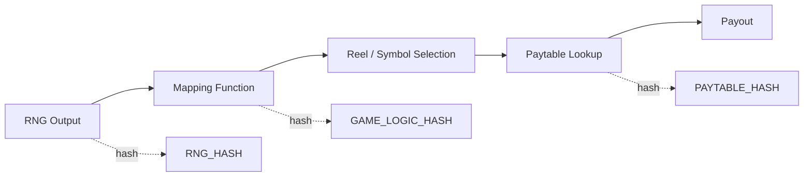

If the operator deploys a new version of the mapping logic, its hash changes, and any verifier comparing against the previously published `game_logic_hash` will immediately detect the change — independent of whether the RNG itself remains untouched.

## 8. Immutable Audit Ledger

Rather than writing every round directly to a public blockchain (costly and unnecessary), CIGP batches rounds into a Merkle tree and periodically anchors only the resulting root:

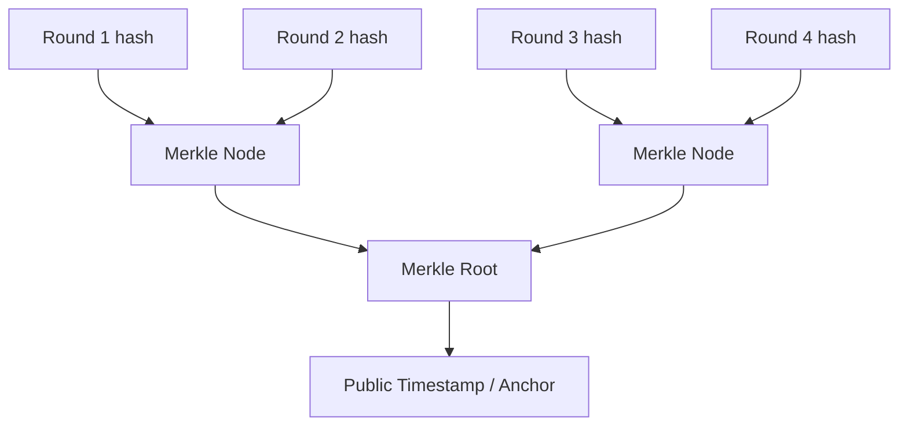

This allows any single round to be proven a member of a specific, timestamped audit batch — without publishing every round's raw data, and without making the system dependent on any particular blockchain for day-to-day operation.

## 9. Statistical Integrity Engine

Cryptographic validity confirms that a round was *computed as declared*. It does not, by itself, confirm that the RNG's long-run behaviour matches the declared mathematics. CIGP separates three distinct quantities and compares them statistically rather than superficially:

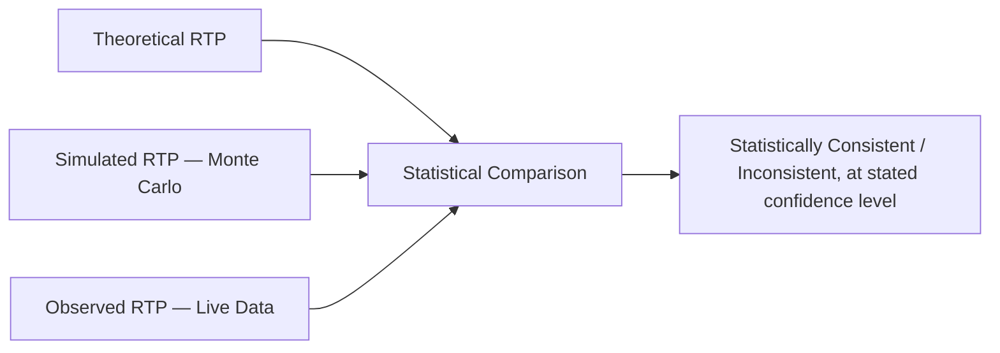

Planned statistical tests (v0.2) include frequency/equidistribution, chi-square, independence, autocorrelation, runs, and entropy tests, evaluated at a stated confidence level (e.g. 99%), consistent in spirit with the categories of tests referenced by GLI-19 for RNG and game-outcome testing.

## 10. Physical Casino Bridge

For physical slot machines, a lightweight observation agent attests to machine identity and firmware state without controlling the machine itself:

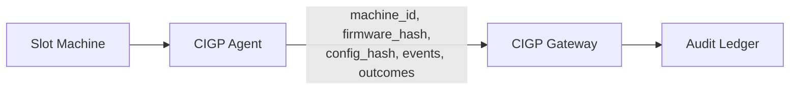

At boot, the agent measures the running firmware, hashes it, and compares it against the expected published hash — flagging any unexpected configuration or firmware change as an attestation mismatch.

## 11. Trust Levels

CIGP defines four explicit, cumulative levels of verification, so that a "verified" badge never overstates what was actually checked:

| Level | Name | What is verified |
|---|---|---|
| 0 | **Unverified** | No sufficient evidence available. |
| 1 | **Cryptographically Verified** | The RoundProof itself is valid (signature, commitment, hash chain). |
| 2 | **System Verified** | Round proof **and** game logic, paytable, and configuration hashes match published manifests. |
| 3 | **Independently Audited** | Level 2 plus confirmation from an independent test laboratory and/or regulatory evidence. |

**Level 3 does not, by itself, constitute or replace a gambling license.**

## 12. What CIGP Does NOT Claim

This is deliberate and central to the protocol's credibility. CIGP does **not** assert:

> "This casino is honest."

CIGP asserts only narrower, mechanically checkable facts:

- ✅ This proof corresponds to this specific round.
- ✅ The outcome is independently reproducible from the published inputs.
- ✅ The configuration in effect was exactly *X*.
- ✅ The game logic in effect had hash *Y*.
- ✅ The paytable in effect had hash *Z*.
- ✅ This event exists, unaltered, in the audit chain.
- ✅ Observed statistical data is (or is not) consistent with the declared mathematical model, at a stated confidence level.

CIGP is **evidence infrastructure**. It does not replace accredited testing laboratories, and it does not replace the licensing authority of any jurisdiction.

## 13. Repository Structure

```
CIGP-Protocol/
├── README.md
├── LICENSE
├── SECURITY.md
├── CONTRIBUTING.md
├── GOVERNANCE.md
├── CODE_OF_CONDUCT.md
├── assets/
│   └── cigp-protocol-banner.png
├── spec/
│   ├── CIGP-0.1.md
│   ├── round-proof.md
│   ├── game-manifest.md
│   ├── audit-ledger.md
│   ├── merkle-proof.md
│   └── verification.md
├── schemas/
│   ├── round-proof.schema.json
│   ├── game-manifest.schema.json
│   ├── audit-event.schema.json
│   └── certificate.schema.json
├── crates/                 # Rust: crypto core, proof engine, ledger, verifier, CLI
├── julia/                  # Julia: statistical / RTP / Monte Carlo engine
├── python/                 # Python: anomaly detection, research notebooks
├── typescript/             # TypeScript: web verifier, dashboard, SDK
├── cli/                    # cigp verify / cigp CLI tooling
├── simulator/               # Reference game simulators (slot, roulette, blackjack, dice)
├── test-vectors/
├── benchmarks/
├── compliance/              # GLI-19, UKGC, jurisdiction mapping notes
├── docs/
│   ├── architecture.md
│   ├── threat-model.md
│   ├── cryptography.md
│   └── deployment.md
└── .github/workflows/
```

## 14. Technology Stack

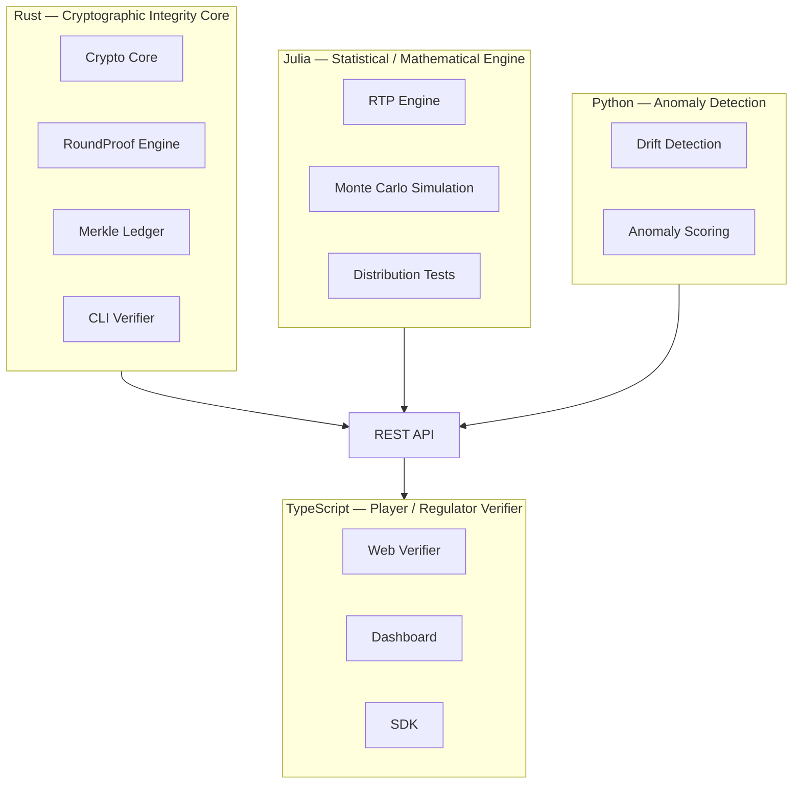

| Layer | Language | Responsibility |
|---|---|---|
| Crypto Core | **Rust** | Hashing, signing, canonical serialization, Merkle ledger, proof generation, CLI verifier |
| Statistics Engine | **Julia** | RTP modelling, Monte Carlo simulation, distribution and independence testing |
| Anomaly Detection | **Python** | Drift detection, ML-based anomaly scoring, research notebooks |
| Verifier / SDKs | **TypeScript** | Web-based independent verifier, dashboards, client SDKs |

## 14a. Implementation Status (v0.1)

This is the current state of the reference implementation, updated as phases land. Anything not listed here is **DESIGN ONLY** — see the Master Engineering Prompt in `docs/` for the full phase plan.

| Component | Crate / package | Status |
|---|---|---|
| Domain types, canonical JSON | `cigp-core` | **IMPLEMENTED** — `RoundProof`, `GameManifest`, `Money` (integer minor units, no floats), RFC 8785-style canonicalization |
| Cryptographic primitives | `cigp-crypto` | **IMPLEMENTED** — SHA-256 hashing/commitments, `CIGP-REFERENCE-HMAC-SHA256` commit-reveal RNG derivation, HKDF expansion, Ed25519 signing/verification, domain-separated Merkle trees with inclusion proofs |
| Proof construction & verification | `cigp-proof` | **IMPLEMENTED** — `build_round_proof`, `compute_round_hash`, `verify_round_proof` producing a field-by-field `VerificationReport` |
| Audit ledger | `cigp-ledger` | **IMPLEMENTED** — append-only hash-linked chain, independent `verify_chain`, Merkle batch commitment over stored rounds |
| CLI verifier (`cigp verify`) | `cli/cigp` | NOT IMPLEMENTED |
| Demo slot simulator | `simulator/slot` | NOT IMPLEMENTED |
| Statistical engine | `julia/CIGPStatistics.jl` | NOT IMPLEMENTED |
| Anomaly research layer | `python/cigp_anomaly` | NOT IMPLEMENTED |
| Browser verifier | `typescript/cigp-verifier` | NOT IMPLEMENTED |
| Cross-language test vectors | `test-vectors/` | NOT IMPLEMENTED |

### Building and testing the Rust core

```bash
# From the repository root
cargo build --workspace
cargo test --workspace
```

### Running the tamper-detection demonstration

`cigp-proof` ships an example that builds a valid, signed `RoundProof`, verifies it, then deliberately tampers with the `payout` field and re-verifies to show the tamper is caught:

```bash
cargo run -p cigp-proof --example tamper_demo
```

Expected output:

```
CIGP Verification
Protocol version: 0.1
Round ID: round-demo-0001
Signature: PASS
Commitment: PASS
Seed derivation: PASS
Round hash: PASS
RESULT: VALID

CIGP Verification (tampered payout)
Round ID: round-demo-0001
Signature: PASS
Round hash: FAIL
RESULT: INVALID
```

Note that `Signature: PASS` still holds against the tampered proof, because the Ed25519 signature is checked against the proof's *stored* `round_hash` field, which the tamperer did not update; the check that actually catches the tamper is `Round hash: FAIL` — the independently *recomputed* hash over the (now-inconsistent) content no longer matches. `VerificationReport::is_valid()` requires every check to pass, so the overall result is correctly `INVALID`. A full CLI verifier (`cigp verify`) that also cross-checks a claimed `round_hash` against a separately supplied expectation is planned as the next phase.

## 15. Roadmap

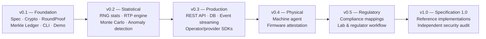

## 16. Relation to Existing Standards

CIGP is designed to complement, not replace, existing regulatory and technical frameworks:

- **GLI-19** and comparable technical standards already require statistical independence, correct distribution, and cryptographic robustness of RNG and mapping components; CIGP operationalises continuous, per-round evidence generation against that same class of requirement.
- **UK Gambling Commission** requirements around demonstrably "acceptably random" outcomes and prohibitions on adaptive game behaviour motivate CIGP's explicit separation between theoretical, simulated, and observed RTP.
- Existing "provably fair" implementations (commit-reveal schemes, HMAC-based verification) address RNG verification. CIGP extends this model to also fingerprint game logic, paytables, and configuration — not RNG output alone.

CIGP does not certify games and does not replace accredited independent test laboratories or jurisdictional licensing processes; it produces machine-checkable evidence that such laboratories, regulators, and the public can use.

## 17. Contributing

This is an open specification under active development. Issues, proposals, and pull requests are welcome — see [`CONTRIBUTING.md`](CONTRIBUTING.md) for the process and [`GOVERNANCE.md`](GOVERNANCE.md) for how protocol changes are decided. Please review [`SECURITY.md`](SECURITY.md) before reporting any vulnerability.

## 18. License

This project is licensed under the **Apache License 2.0** — see [`LICENSE`](LICENSE) for the full text.

```
Copyright 2026 Ciprian Ștefan Pleșca

Licensed under the Apache License, Version 2.0 (the "License");
you may not use this file except in compliance with the License.
You may obtain a copy of the License at

    http://www.apache.org/licenses/LICENSE-2.0

Unless required by applicable law or agreed to in writing, software
distributed under the License is distributed on an "AS IS" BASIS,
WITHOUT WARRANTIES OR CONDITIONS OF ANY KIND, either express or implied.
See the License for the specific language governing permissions and
limitations under the License.
```

---

<p align="center"><sub>CIGP-Protocol — an open-source initiative. Not a gambling operator. Not investment or legal advice.</sub></p>
