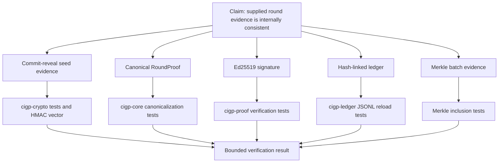
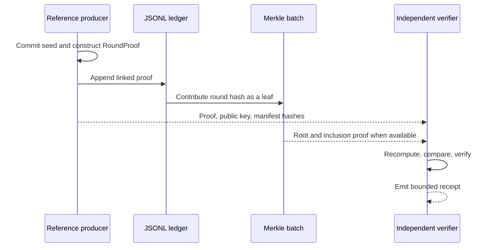

# CIGP Evidence Graph

Author: **Ciprian Ștefan Pleșca**  
Protocol version: `0.1`  
Status: Research assurance case

## Purpose

The Evidence Graph is an assurance case for a narrow question: *what does a CIGP verification result establish, and what evidence supports that result?* It is designed for reviewers, implementers, and independent researchers who need a traceable path from a claim to code and test evidence.

## Claims, Evidence, and Boundaries

| Claim | Evidence artifact | Independent check | Residual boundary |
| --- | --- | --- | --- |
| A disclosed server seed matches its earlier declaration. | `server_commitment`, disclosed seed, SHA-256 profile. | Recompute the commitment. | It does not prove when the commitment was published or that the seed was unavailable before play. |
| The declared seed inputs derive the reported reference RNG output. | Client seed, nonce, server seed, canonical HMAC vector. | Recompute HMAC-SHA-256. | It does not prove a production system used that output at runtime. |
| The recorded proof fields were not silently edited after signing. | Canonical round hash and Ed25519 signature. | Recompute hash and verify against the public key. | A compromised signing key can produce valid-looking evidence. |
| Consecutive recorded rounds are linked in their stated order. | `previous_round_hash` and JSONL ledger. | Verify each predecessor link. | Missing, withheld, or externally unanchored history remains possible. |
| A published batch contains a stated round. | Merkle root, inclusion path, leaf index. | Verify the inclusion proof. | A root has no independent meaning unless it is published or anchored in a trusted context. |
| A declared game definition remained the same in a proof. | Logic, paytable, and configuration hashes. | Compare hashes with a known manifest. | Hash equality does not attest the deployed binary or physical device. |

## Evidence Lifecycle

## Interpretation Rules

1. Treat `VALID` as a consistency result for supplied evidence, never as a universal trust statement.
2. Preserve the source proof, verifier version, public key, and receipt together.
3. Record an `INCONCLUSIVE` result when an input is missing rather than inferring a passing result.
4. Investigate anomalies proportionately; an anomaly is not an accusation of fraud.
5. Use external governance, audits, and regulatory processes for claims beyond the CIGP evidence boundary.

The canonical adversarial assumptions are maintained in the [security threat model](../security/threat-model.md).
