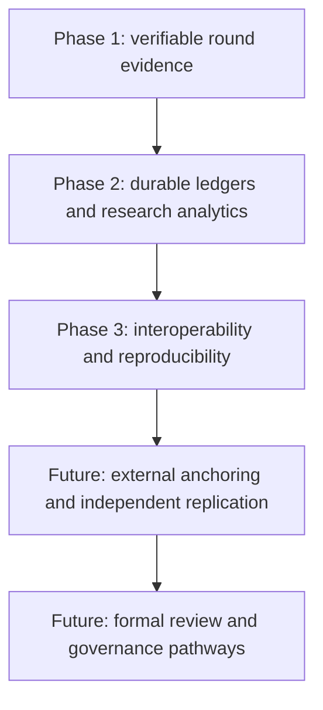

# CIGP Position Paper: Evidence Before Assertion

Author: **Ciprian Ștefan Pleșca**  
Independent researcher, Roman, Neamț, Romania  
Protocol version: `0.1`

## Abstract

CIGP proposes an open evidence model for declared gaming-system events. Its core contribution is not a promise that a system is fair; it is a structured way to make specific event claims independently reproducible. A `RoundProof` binds declared inputs, derived output, game-definition fingerprints, a canonical hash, and a signature. Linked ledgers and Merkle batches extend that evidence from one event to a reviewable sequence.

## Problem

Public claims about integrity are often difficult to examine independently. A reviewer may receive a screenshot, a database export, or a verbal assurance, yet lack the inputs required to reproduce the claimed event. CIGP narrows the problem to evidence consistency: can a verifier recompute the stated construction and detect changes to the supplied record?

## Contribution

The v0.1 reference release provides:

- canonical JSON hashing and a defined HMAC-SHA-256 derivation profile;
- Ed25519-signed `RoundProof` records;
- a JSONL hash-linked audit ledger and Merkle inclusion mechanisms;
- deliberately valid and tampered fixtures;
- Rust, Python, TypeScript, and Julia research components;
- a portable verification-receipt schema for recording verifier outcomes.

## Epistemic Boundary

CIGP does not infer operational honesty from cryptographic consistency. It does not operate real-money games, process payments, certify products, replace regulation, or establish statistical fairness from a small sample. A trustworthy research protocol must make these limits first-class artifacts rather than footnotes.

## Research Agenda

Future work should prioritize independent replication, key-management procedures, external timestamp or transparency-log anchoring, formal specification review, and careful dialogue with legal and regulatory experts. These are research directions, not claims that such controls are already present.
