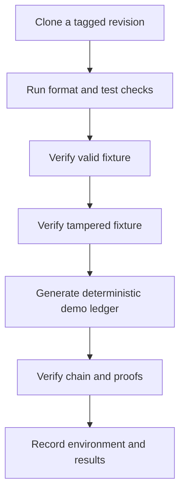

# CIGP Reproducibility Capsule

Author: **Ciprian Ștefan Pleșca**  
Protocol version: `0.1`  
Status: Repeatable research procedure

## Objective

This capsule gives an independent researcher a minimum, repeatable route to verify the reference implementation and its deliberate tamper case. It is not a deployment guide and does not require access to any gambling service, payment system, or personal data.

## Inputs

| Item | Repository location | Role |
| --- | --- | --- |
| Rust workspace | `Cargo.toml` | Reference implementation and test runner. |
| Valid proof | `test-vectors/demo-round.json` | Positive verification fixture. |
| Tampered proof | `test-vectors/tampered-round.json` | Negative verification fixture. |
| Cross-language vector | `test-vectors/canonical-hmac-v1.json` | Canonical JSON and HMAC interoperability evidence. |
| Public key | `test-vectors/demo-round.pubkey` | Verification identity for the demo. |

## Procedure

```bash
cargo fmt --all -- --check
cargo test --workspace
cargo run -p cigp -- verify test-vectors/demo-round.json
cargo run -p cigp -- verify test-vectors/tampered-round.json
cargo run -p cigp -- generate-demo-ledger 100 output
cargo run -p cigp -- ledger-verify output/demo-ledger.jsonl <public-key-hex>
cargo run -p cigp -- stats output/demo-ledger.jsonl
```

Expected observations:

- Formatting and workspace tests complete successfully.
- The valid fixture reports `RESULT: VALID`.
- The tampered fixture reports `RESULT: INVALID` and exits with code `1`.
- The generated ledger verifies its hash chain and proof checks.
- Statistics are marked descriptive only and must not be read as proof of fairness.



## Research Record

For a citable reproduction, record the repository commit, operating system, Rust toolchain version, command output, fixture hashes, and verifier version. Do not replace an original result with a regenerated fixture without noting the replacement.

## Failure Interpretation

| Observation | Interpretation |
| --- | --- |
| Valid fixture fails | Investigate toolchain, source revision, fixture integrity, or a regression. |
| Tampered fixture passes | Treat as a security-relevant defect. |
| Ledger verification fails | Treat the ledger as inconsistent until the missing or altered evidence is explained. |
| Statistical output differs | Compare sample size, source revision, and deterministic inputs before making any inference. |

This capsule produces reproducible software evidence. It does not certify a real operator, game, casino, device, or statistical population.
