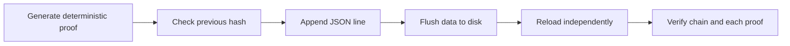

# JSONL Audit Ledger Operations

The Phase 3 reference ledger persists one `RoundProof` per line in UTF-8 JSON Lines format. It is a local, durable research adapter, not a production database or a replacement for operational access controls.



## Generate a Reference Ledger

```bash
cargo run -p cigp -- generate-demo-ledger 100 output
```

This creates `output/demo-ledger.jsonl`, `output/demo-ledger.pubkey`, and `output/demo-statistics.json`. The command refuses to overwrite an existing ledger path.

## Verify a Ledger

```bash
cargo run -p cigp -- ledger-verify output/demo-ledger.jsonl <public-key-hex>
cargo run -p cigp -- stats output/demo-ledger.jsonl
```

Verification reloads every line, checks the hash chain, verifies each `RoundProof`, and derives a Merkle root. The statistics command reports sample size, observed RTP, payout variance, and a descriptive 95% interval. Neither command certifies fairness, regulatory compliance, or production integrity.

## Operational Limits

- The file adapter synchronously flushes successful appends but does not provide distributed consensus, multi-writer coordination, encryption at rest, backups, or access control.
- Production use requires reviewed key management, durable storage design, monitoring, backup/recovery practice, access control, and independent security review.
- The deterministic seed and key in the demo workflow are public test material only.
