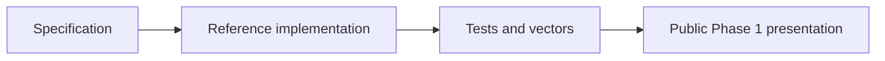

# Phase 1 / Stage 1 Release Note

**Author:** Ciprian Ștefan Pleșca

**Tag:** `v0.1.0-phase.1`

This tag records the first public academic presentation of the CIGP reference implementation. It represents a reproducible research milestone, not a production certification release.

Included scope: core domain model, cryptographic profile, proof construction and verification, hash-linked ledger, Merkle proofs, virtual-credit demo, tamper detection, academic wiki, and project manifesto.

Excluded scope: real-money operation, production key management, certification, durable operational storage, legal compliance, and claims of fairness or honesty.
