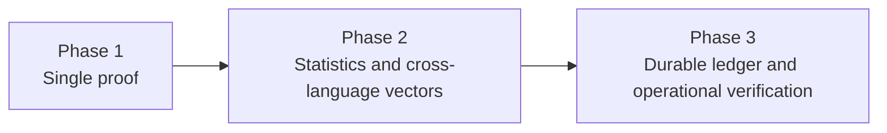

# Phase 2 and Phase 3 Research Increment

**Author:** Ciprian Ștefan Pleșca

This increment extends the Phase 1 reference evidence loop with reproducible descriptive statistics, cross-language reference vectors, a durable JSONL ledger adapter, and operational verification commands.

## Delivered

- `cigp-statistics`: deterministic RTP, variance, and descriptive confidence interval reporting.
- Python and TypeScript reproduction tests for canonicalization and HMAC-SHA-256 reference vectors.
- Julia descriptive functions for frequencies, confidence intervals, chi-square statistics, and lag-one autocorrelation.
- `JsonlLedger`: append-only, reloadable JSON Lines adapter with chain validation.
- CLI commands for deterministic ledger generation, full ledger verification, and descriptive statistics.
- CI coverage for Rust, Python, TypeScript, and Julia.

## Boundaries

The statistics are descriptive research output. A confidence interval or chi-square statistic is not proof of fairness. The JSONL adapter is not a production database, distributed ledger, certification tool, or real-money gaming system.
