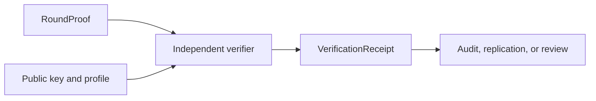

# CIGP Verification Receipt Standard

Protocol version: `0.1`  
Status: Draft research standard

## Purpose

A `VerificationReceipt` is a portable record of what an independent verifier checked for one CIGP artifact. It records a conclusion and the inputs necessary to interpret that conclusion. It does not issue a certificate, rating, or regulatory finding.

## Normative Rules

- A receipt MUST identify the CIGP version, verifier implementation, subject, status, and verification time.
- A receipt with status `VALID` MUST list checks performed and identify the source proof by its round hash.
- A receipt with status `INVALID` MUST identify at least one failed check.
- A receipt with status `INCONCLUSIVE` MUST state which required evidence was unavailable.
- Implementations MUST NOT interpret `VALID` as certification, legal approval, operational honesty, or statistical fairness.

## Status Values

| Status | Meaning |
| --- | --- |
| `VALID` | All listed checks passed for the supplied artifacts. |
| `INVALID` | At least one listed consistency or authenticity check failed. |
| `INCONCLUSIVE` | Required evidence was absent, unreadable, unsupported, or outside the verifier profile. |

## Schema and Example

The machine-readable contract is [verification-receipt.schema.json](../../schemas/verification-receipt.schema.json). A non-authoritative example is available at [verification-receipt.example.json](../../test-vectors/verification-receipt.example.json).

The receipt should be stored alongside the source proof, verifier build identifier, public key, and any relevant manifest. This preserves the distinction between evidence, a verifier's observation, and a broader institutional conclusion.
