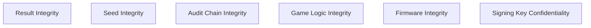

# Threat Model

## Adversary Classes

CIGP's design assumes the adversary may be any of the following, individually or in combination:

- **Player** — attempting to forge a favourable proof or replay a prior winning round.
- **Operator** — attempting to alter game logic, paytable, or RNG mapping without detection.
- **Game supplier** — shipping a game version that does not match its published manifest.
- **Insider** — with privileged access to seeds, keys, or configuration.
- **Network attacker** — intercepting or altering data in transit.
- **Malicious update** — a software or firmware update that silently changes game behaviour.
- **Compromised server** — an operator-side system compromised by a third party.
- **Compromised machine** — a physical device compromised at the hardware or firmware level.

## Assets to Protect

## Specific Threats and Mitigations

| Threat | Mitigation |
|---|---|
| Result manipulation after bet placement | Commit-reveal seed scheme (Section 4 of spec); signed RoundProof |
| Seed manipulation / predictable seeds | `server_commitment` published before play; HMAC-based derivation |
| Replay of a prior favourable round | Unique `nonce` per `server_seed`; round hash chain |
| Tampering with historical rounds | Hash-linked ledger; any change invalidates all subsequent hashes |
| Undisclosed configuration changes | `configuration_hash` published in `GameManifest`; mismatch is detectable |
| Game-logic substitution | `game_logic_hash` fingerprinting, independent of RNG verification |
| Audit deletion | Merkle batch anchoring to a public, external anchor |
| Log modification | Append-only ledger design; Merkle inclusion proofs |
| Firmware substitution (physical machines) | Boot-time firmware hashing and attestation (Section 10 of README) |
| Signing key compromise | Key rotation procedures (see `docs/cryptography.md`); revocation via published key registry |

## Explicit Non-Goals

The threat model explicitly does **not** attempt to:

- Prevent an operator from being dishonest about facts CIGP does not capture (e.g. marketing claims unrelated to round computation).
- Replace legal, contractual, or regulatory enforcement mechanisms.
- Guarantee the physical security of a casino's premises or general IT infrastructure beyond the specific components listed above.
