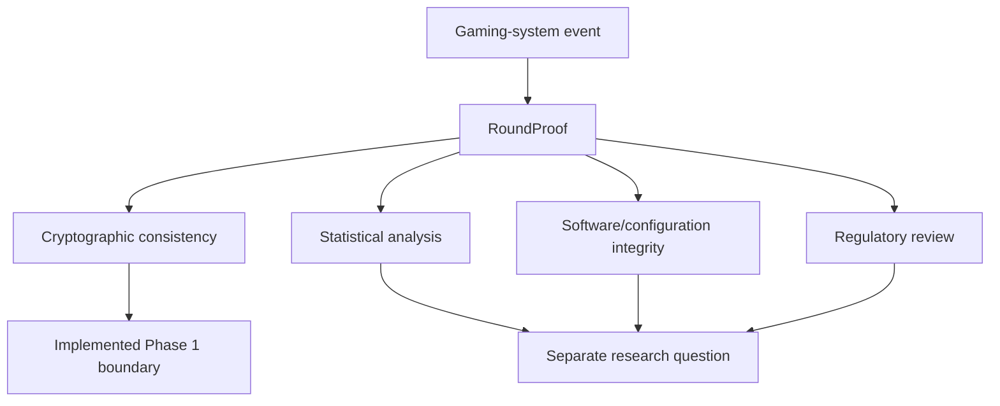

# Research Question

**Author:** Ciprian Ștefan Pleșca

## Question

How can a gaming-system event be represented so that an independent observer can reproduce declared cryptographic evidence without trusting the storage system or the operator's verbal assertion?

The question is intentionally narrower than whether a game is fair, certified, licensed, or commercially appropriate. Those questions require statistical, operational, legal, and institutional evidence beyond a single proof object.

## Hypothesis

If a round's inputs, derivation evidence, outcome, fingerprints, previous hash, and signature are represented canonically, an independent verifier can detect a modification to the disclosed proof without trusting a database implementation.

## Evaluation Criterion

The Phase 1 criterion is binary and reproducible: the generated fixture verifies as `VALID`; a fixture with a changed payout verifies as `INVALID`.

