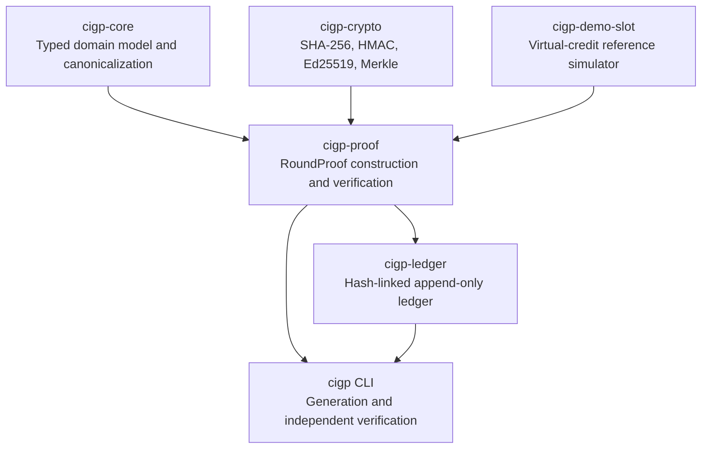
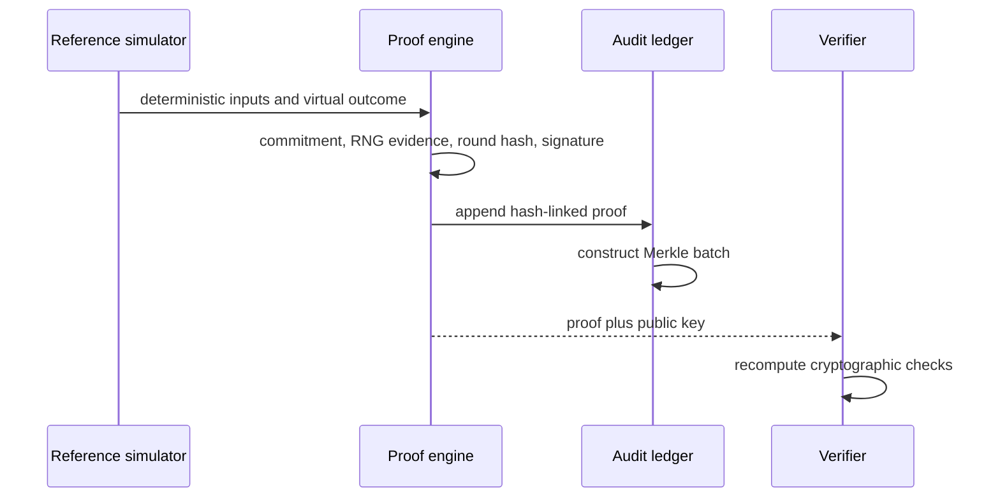

# Architecture

**Author:** Ciprian Ștefan Pleșca

The Phase 1 architecture separates domain representation, cryptography, proof construction, ledger integrity, and verification. This separation makes it possible to inspect each responsibility independently.

## Evidence Lifecycle

The data boundary is intentional: the proof contains evidence required for verification, not player identity, payment information, passwords, or production secrets.

