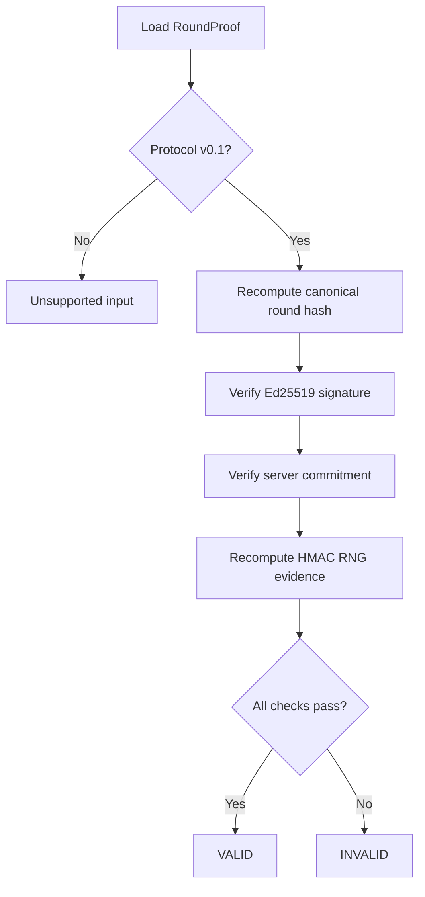

# Verification Method

**Author:** Ciprian Ștefan Pleșca

Phase 1 uses deterministic fixtures so a result can be reproduced from a clean checkout. The verifier checks the current protocol version, recomputes the canonical round hash, verifies the Ed25519 signature, checks the revealed seed against the commitment, and recomputes the HMAC-based derivation.



## Reproducibility Procedure

```bash
cargo test --workspace
cargo run -p cigp -- generate-demo-round test-vectors
cargo run -p cigp -- verify test-vectors/demo-round.json
cargo run -p cigp -- verify test-vectors/tampered-round.json
```

The second verification command is expected to return exit code `1`. That failure is the experiment's negative control, not a system error.

## Interpretation

`VALID` means that the evidence supplied to the reference verifier is internally consistent with the implemented reference profile. It does not certify a production deployment or establish any unmeasured property.

