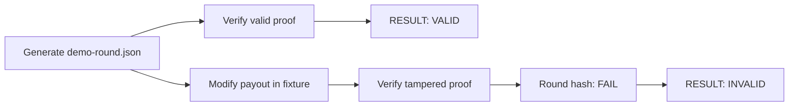

# Phase 1 Results

**Author:** Ciprian Ștefan Pleșca

## Implemented Result

The repository contains a tested vertical slice from deterministic event construction to independent verification and tamper detection.

## Evidence in the Repository

| Artifact | Role |
| --- | --- |
| `crates/cigp-core` | Typed proof and exact monetary values |
| `crates/cigp-crypto` | Reference primitives and Merkle implementation |
| `crates/cigp-proof` | Proof construction and verification report |
| `crates/cigp-ledger` | Hash-chain verification and Merkle batching |
| `cli/cigp` | Reproducible command-line workflow |
| `simulator/slot` | Virtual-credit reference event source |
| `test-vectors` | Valid and negative fixtures |

## Test Scope

The current suite covers canonicalization, money representation, hashing, commit-reveal derivation, signatures, Merkle proofs, ledger links, proof verification, the demo slot, Python anomaly helpers, and TypeScript reference helpers.

Phase 1 does not treat test success as a substitute for independent security review. It establishes a reproducible baseline for such review.

