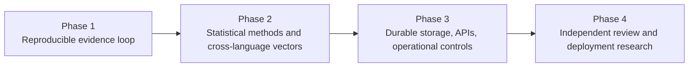
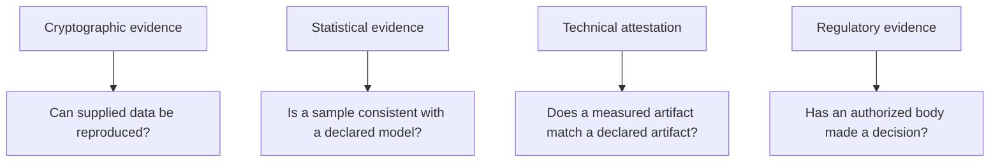

# Limitations and Roadmap

**Author:** Ciprian Ștefan Pleșca

## Current Limitations

- The Rust verifier checks internal cryptographic consistency, but the full independent browser verifier remains research work.
- Julia, Python, and TypeScript components are reference utilities rather than production services.
- The in-memory audit ledger is storage-backend agnostic; durable operational storage is not implemented.
- Statistical consistency, software attestation, and certification are distinct workstreams.
- Physical-machine integration is design-only.

## Research Discipline

Each phase must preserve the distinction below.

These categories are complementary; none should be substituted for another in public claims.

